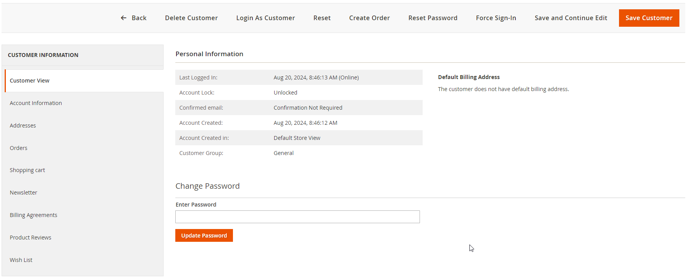

# Change Customer Password In Admin - Magento 2

Change Customer Password In Admin Magento 2 module is implements the form in customer edit which allow admin change
customer password directly like old-fashion way Magento.

---



## Main Features

- Add a quick update Password button to customer view in Admin

## Command-line usage

Call the console command and pass the customers email address and the new password.

```bash
bin/magento customer:change-password test@example.com password123
```

If customer accounts are not shared between websites, a website code has to be specified with the `--website` or `-w`
option.

```bash
bin/magento customer:change-password --website base test@example.com password123
```

## Installation with Composer

- Connect to your server with SSH
- Navigation to your project and run these commands

```bash
composer require dss/m2-change-customer-password-admin


php bin/magento setup:upgrade
rm -rf pub/static/*
rm -rf var/*

php bin/magento setup:static-content:deploy
```

## Installation without Composer

- Download the files from
  github: [Direct download link](https://github.com/dssjignesh/m2-change-customer-password-admin/archive/refs/heads/main.zip)
- Extract archive and copy all directories to app/code/Dss/ChangeCustomerPassword
- Go to project home directory and execute these commands

```bash
php bin/magento setup:upgrade
rm -rf pub/static/*
rm -rf var/*

php bin/magento setup:static-content:deploy
```
